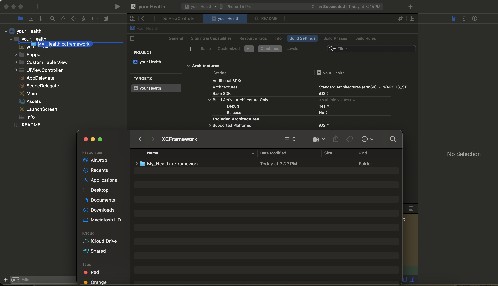
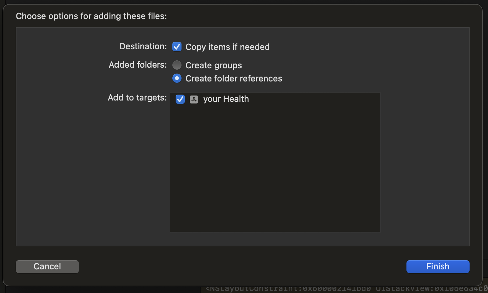
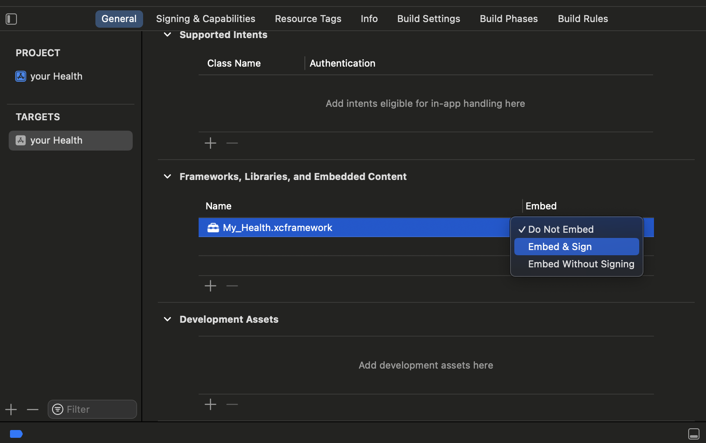
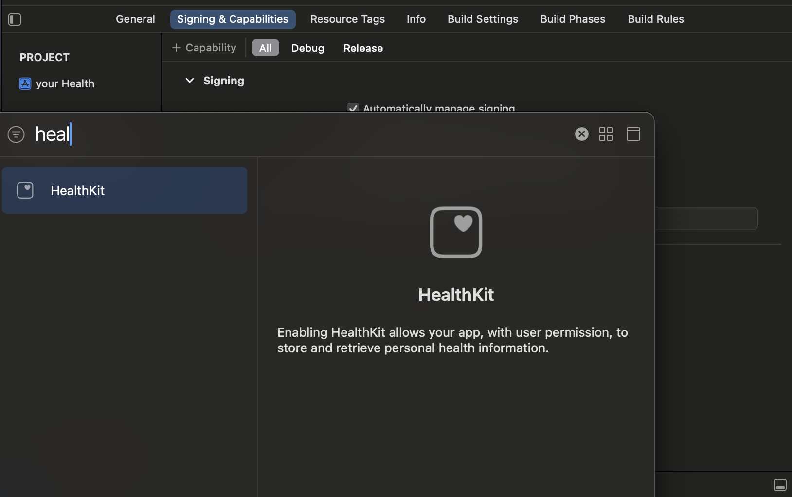

# Integrating My_Health SDK in an iOS App

This guide provides instructions to integrate the My_Health SDK and configure its required permissions.

---

## Steps to Set Up My_Health SDK in Your Project

### Adding XCFramework to Your Project

- Obtain the framework from the demo app and drag it into your project, as shown in the image below.

  

- After adding the framework, a pop-up will appear prompting you to add the framework to the target.
- Select **Copy items if needed** and click **Add to Target**, as shown below.

   

- Once the XCFramework is added, navigate to your project settings:  
  `TARGETS > General > Frameworks, Libraries, and Embedded Content`,  
  and set **My_Health.xcframework** to **Embed & Sign**, as shown in the image below.

   

---

### Adding HealthKit Entitlement to Your Project

- To enable HealthKit in your project:  
  1. Go to `TARGETS > Signing & Capabilities`.
  2. Click **+ Capability** and add **HealthKit**, as shown in the image below.

   

---

### Adding Permissions to the info.plist

- Add the Below Permissions in the info.plist file  
  `Privacy - Health Share Usage Description`  
  `Privacy - Health Records Usage Description`

---

### Initializing the SDK in Your App

#### Step 1: Import and Initialize the `My_Health` SDK

```swift
import My_Health // Import the necessary module

let getHealth = GetHealth() // Initialize the SDK
```

#### Step 2: Request and Check for Permissions

```swift
getHealth.checkPermission { status in
    if status == "Granted" {
        print("Permission Granted")
    } else {
        print("Permission Denied")
    }
}
```

#### Step 3: Fetch Health Data

```swift
getHealth.getHealthData { fetchedData in
    print("\(fetchedData)")
}
```

*Note:* The structure of `fetchedData` is as follows:

```swift
[
    ["heart_rate": 65, "date": "08/02/25", "steps": 1220, "sleep_duration": "8h 13m"],
    ...
]
```

---


